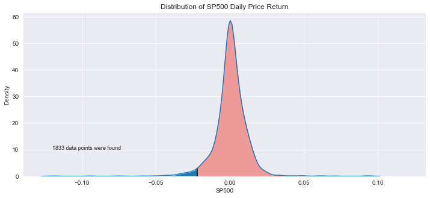
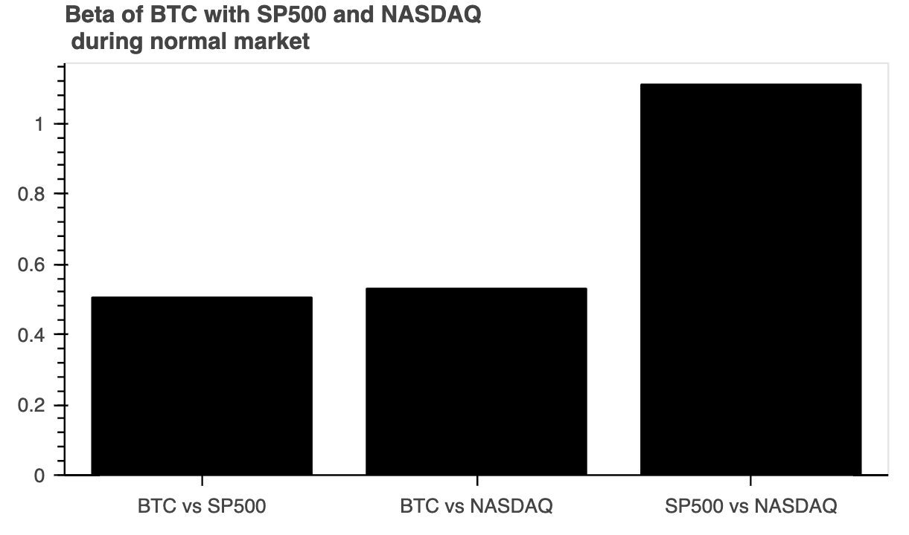

# Exploring Bitcoin: Is it a Good Portfolio Diversifier?

This analysis aims to evaluate Bitcoin as a diversification instrument to an all US-equity portfolio.

## Contents

* Usage
* Data source & libraries
* Project hypothesis
* Initial methodology
* Updated methodology
* Assumptions
* Calculations
* Results and discussion

## Usage

You must have Anaconda and Jupyter Lab installed and be running Python >= 3.7 to run this dashboard.

1. Set up a new Anaconda environment called `pyvizenv`.

    ```shell
    conda update anaconda
    conda create -n pyvizenv python=3.7 anaconda -y
    conda activate pyvizenv
    ```

2. Install environment dependencies.
    ```shell
    pip install python-dotenv
    pip install numpy==1.19
    pip install matplotlib==3.0.3

    conda install -c conda-forge nodejs=12 -y
    conda install -c pyviz holoviz -y
    conda install -c plotly plotly -y
    conda install -c conda-forge jupyterlab=2.2 -y
    ```

3. Install the Jupyter Lab extensions.

    ```shell
    jupyter labextension install @jupyter-widgets/jupyterlab-manager --no-build
    jupyter labextension install jupyterlab-plotly --no-build
    jupyter labextension install plotlywidget --no-build
    jupyter labextension install @pyviz/jupyterlab_pyviz --no-build
    ```

4. Build the Extensions.

    ```shell
    jupyter lab build
    ```

5. Ensure the successful installation of the dependencies by finding them in Anaconda.

    ```shell
    conda list nodejs
    conda list holoviz
    conda list hvplot
    conda list panel
    conda list plotly
    ```

### Data Sources
* Yahoo Finance API


### Libraries
* Pandas
* Seaborn
* Plotly Express
* Holoviz
* Panel
* Tabulate

## Project Hypothesis
This project is focused on using quantitative analysis in python to test bitcoin as a diversification instrument to an all US equity portfolio. Price data was retrieved from the yFinance API To determine the characteristics of BTC in comparison to the S&P 500 and NASDAQ indices (hereafter referred to as “the indices”).


## Hypothesis of Bitcoin’s Diversification Characteristics
* Investors commonly hold gold or low beta bonds and assets to diversify their portfolio. As investing in cryptocurrencies becomes more popular, investors can also consider holding bitcoin to diversify their portfolio.
* Similar to gold, BTC has a fixed quantity of units available (21 million coins). Therefore, unlike equity assets, BTC cannot be diluted due to many monetary policy changes.
* The price of Bitcoin is also largely determined by the perceived value of the asset and may not experience price changes that would be correlated with sudden changes in the US equity market.


## Initial Methodology
Initially, we measured the indices beta in relation to BTC, and we measured the correlation between each index and BTC. Because of the volatile characteristics of BTC, the data we collected appeared to be random in nature and revealed no insight about BTC’s diversification properties.

## Updated Methodology

We then pivoted our analysis to see how BTC behaves under different market environments. We found this to be an interesting proposition because we may be able to gain insight into how BTC behaves when the indices experience a sell-off.

We began by defining the two market environments as a normal market environment and a sell-off market environment. We assumed that a sell-off market environment could be seen as a collection of trading days in our S&P 500 dataset where the percent price change is lower than two standard deviations from the mean percent price change of our dataset. Therefore, we defined our normal market environment to be a collection of all trading days that are not included in the sell-off market environment.

The correlation between BTC and the S&P 500, and BTC and the NASDAQ was tested within each market environment to see if there is a significant difference in the correlation. The beta of the indices in relation to BTC in each market environment were then calculated. Finally, the sharpe ratios of a portfolio with all US-equities and a portfolio with 50% BTC and 50% US-equities were compared.

The resulting findings would help us understand the implications of including BTC in your portfolio as an asset and whether or not it has any diversification properties.



Figure 1: There are 1833 data points in the S&P 500 data frame above -2 standard deviations from the mean. The pink area in the normal distribution curve therefore represents the the normal market environment.


Figure 2: There are 50 data points in the S&P 500 data frame below -2 standard deviations from the mean. The pink area in the normal distribution curve therefore represents the sell-off market environment.

## Assumptions

* A Normal Market Environment can be defined as any daily returns that fall above -2 standard deviations of the S&P 500’s daily price return.
* A sell-off market environment can be defined as any daily returns that fall below -2 standard deviations of the S&P 500’s daily price return.
* Our data spans from September 17. 2014 to the present day due to BTC’s recent inception. This excludes the majority of the timelines of the S&P 500 Index and the NASDAQ Composite Index.

## Calculations

### Beta Calculations

Beta is found by calculating the covariance of an asset and a market and dividing that covariance by the variance of the market.

Therefore, we completed three beta calculations for each market environment:

### Normal Market Environment

* Bitcoin’s beta in relation to the S&P 500
* Bitcoin’s beta in relation to the NASDAQ
* S&P’s beta in relation to the NASDAQ (as a baseline measurement)

### Sell-off Market Environment

* Bitcoin’s beta in relation to the S&P 500
* Bitcoin’s beta in relation to the NASDAQ
* S&P’s beta in relation to the NASDAQ (as a baseline measurement)

We then interpreted any significant difference in the results of the two market environments as Bitcoin’s predicted behaviour in each environment.

### Correlation Calculations
We utilized the .corr() function in the pandas library to calculate the correlation of each asset in each environment.

### Sharpe Ratio
We also calculated the sharpe ratio of a portfolio that is composed of all US-equities and compared that to the sharpe ratio of a portfolio that is half US-equities and half Bitcoin.

## Results

### Beta
In a normal market environment, Bitcoin’s beta is 0.51 against the S&P 500 and 0.53 against the NASDAQ.

In a sell-off market environment, Bitcoin’s beta increases to 2.38 against the S&P 500 and 2.24 against the NASDAQ.

Therefore, it may be more difficult for investors to hold bitcoin due to the higher volatility and risk characteristics of the asset.


Figure 3: Betas of BTC in comparison to each indice in the normal market environment.


Figure 4: Betas of BTC in comparison to each indice in the sell-off market environment.

### Correlation
In a normal market environment, Bitcoin’s has a correlation of 0.11 awith the S&P 500 and 0.13 against the NASDAQ.

In a sell-off market environment, Bitcoin’s beta increases to 2.38 against the S&P 500 and 2.24 against the NASDAQ.

The correlation between BTC and each of the indices becomes 5x more correlated. Therefore, if the market experiences a sell-off you would expect BTC to also sell-off about half of the times.

This shows us that BTC may not be a good diversification instrument because when the market sells off, you would want to also hold an asset that trades inversely with the market to hold the value of your portfolio.


Figure 5: correlation of BTC in comparison to each indice in the normal market environment.


Figure 6: correlation of BTC in comparison to each indice in the normal market environment.

### Sharpe Ratio
In a normal market environment, Bitcoin has an annualized Sharpe ratio of 1.18, while the S&P 500’s is 0.67 and the Nasdaq’s is 0.79. However, the highest Sharpe ratio comes from a combination of Bitcoin and US equities.

In a market sell-off environment, Bitcoin’s annualized sharpe ratio is -3.41, while the S&P 500’s is a whopping -30.93 and the Nasdaq’s is -33.3.

This shows that there is an advantage to be had when investing in Bitcoin.


Figure 7: correlation of BTC in comparison to each indice in the normal market environment.


Figure 8: correlation of BTC in comparison to each indice in the sell-off market environment.

## Conclusion

Bitcoin is even more correlated with the major indices during sell-offs, and is also more volatile. If liquidity is needed or the investor has a low risk tolerance, Bitcoin would not be an ideal diversifier.

If the time horizon is long-term, risk tolerance is high, and maximum returns are the investment goal, diversifying an all-US equity portfolio with Bitcoin could be more profitable.
